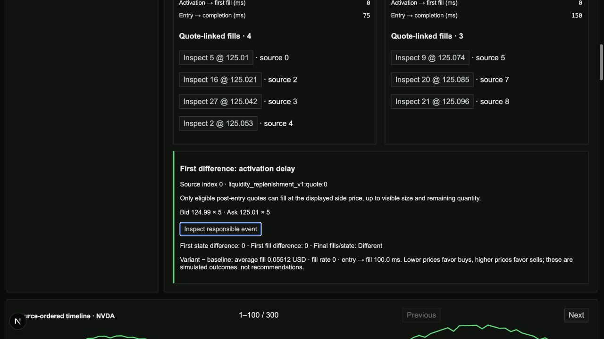

# Ticker Trace

A local-first stock-execution laboratory: submit simulated market/limit orders against private Alpaca IEX quotes, or replay a saved interval and explain the first event where two configurations diverge. Redis Streams separates ingestion, execution, and persistence; Next.js makes the triggering quotes inspectable. Generated scenarios provide a public-safe demo without vendor credentials. Online hosting is deferred.



The screenshot uses generated prices, not live market data. See the [reproducible demo](docs/DEMO.md), [architecture and tradeoffs](docs/ARCHITECTURE.md), and [measured results](docs/BENCHMARKS.md).

The system is an educational and research simulator. It does not place real orders, provide investment recommendations, reconstruct full Level 2 books, or claim exchange-accurate fills.

## Private recorded execution comparisons

The local `/recorded` laboratory captures a bounded interval from the existing ingestion connection, then runs one simulation or two independent experiments against that immutable input. Change quantity, artificial latency, limit price, or market/limit type; inspect the first source event where execution differs and each fill's original quote. This is an auditable comparison workflow, not a claim of novel replay technology or proven trader demand.

Recordings use validated JSONL plus a versioned SHA-256 manifest, retain source-entry order and available market timestamps, and remain outside Git and container images. Saved input replays offline through Redis and separate engine/persistence subprocesses into PostgreSQL. Entry boundaries exclude earlier equal-time events; pacing does not change canonical outcomes. Public APIs and WebSockets cannot read private recorded runs.

Capture requires account recording/storage permission confirmation. Bounds are ten minutes, 80,000 events, or 64 MiB per recording; aggregate private artifacts are limited to 256 MiB and ten saved experiments. No saved recording is automatically evicted. Interrupted captures are not successful replays. Actual private capture/offline acceptance passed October 6 under user-reported personal-use permission. Physical sleep/wake, post-extension fresh-live browser regression, and owner usability remain unverified in the [implementation plan](docs/IMPLEMENTATION_PLAN.md#extension-a--b--c--recorded-market-execution-comparisons).

## Project Goals

- Help technically curious traders and quant students understand how timing and visible liquidity affect order execution.
- Provide a usable web interface for live simulation and deterministic replay.
- Process market and order events concurrently while preserving per-symbol ordering and idempotency.
- Recover unfinished work after worker failure without producing duplicate fills.
- Produce reproducible performance and reliability results suitable for technical interviews and resume bullets.
- Remain small enough for one developer to build, deploy, test, and explain thoroughly.

## Documentation

- [Product specification](docs/PRODUCT_SPEC.md)
- [Implementation plan](docs/IMPLEMENTATION_PLAN.md)
- [Architecture](docs/ARCHITECTURE.md)
- [Data pipeline](docs/DATA_PIPELINE.md)
- [UI plan](docs/UI_PLAN.md)
- [Deployment](docs/DEPLOYMENT.md)
- [Testing](docs/TESTING.md)
- [Benchmark methodology](docs/BENCHMARKS.md)
- [Resume bullets and benchmark metrics](docs/RESUME_BULLETS.md)
- [Pre-Phase 7 build and acceptance checklist](docs/PRE_PHASE_7.md)
- [Generated demo walkthrough](docs/DEMO.md)
- [Interview narrative and claim boundaries](docs/INTERVIEW.md)

## Current Status

- [x] Select the product concept.
- [x] Define the target user and primary workflow.
- [x] Confirm initial market-data availability and public-display restrictions.
- [x] Approve the MVP scope and non-goals.
- [x] Select the initial technology stack.
- [x] Define architecture, data flow, UI, deployment, and test boundaries.
- [x] Complete the core streaming pipeline.
- [x] Add operational health, readiness, structured logs, and pipeline metrics.
- [x] Add a credential-gated private Alpaca IEX ingestion adapter.
- [x] Add the public execution-workspace interface and simulated-order submission.
- [x] Add reproducible fixed-partition load benchmarks.
- [x] Add a reproducible high-volume validation command.
- [x] Connect private session order submission, continuous workers, quote freshness, subscription controls, and a private live UI.
- [x] Add three versioned 300-event public experiments alongside the six small regression fixtures.
- [x] Add backend CLI pacing and continuous offered-load/backlog/durable-write latency validation.
- [x] Verify actual private market-window fills against persisted subsequent IEX quotes and automatic same-session worker replacement.
- [x] Complete Local A bounded lease retry, graceful cleanup, and reconstruction ownership renewal.
- [x] Complete Local B coordinated session rollover and bounded closed-session retention, with generated-process acceptance tests.
- [x] Complete Local C lease-expiry recovery, pause/shutdown checks, 125-test regression suite, and ten-minute synthetic endurance evidence.
- [x] Verify live fills/restarts and ten-minute generated certification at twice a measured subscription-specific live peak on October 5.
- [x] Verify actual private recording, offline comparison, and API-restart result retention on October 6.
- [ ] Verify physical laptop/network recovery, post-extension fresh-live browser regression, and independent owner workflow completion.
- [ ] Deferred cloud acceptance: redeployed concurrent-browser and 24-hour idle-provider-usage checks.

## Technology Stack

- Python, FastAPI, Pydantic, and AsyncIO for ingestion, APIs, and WebSockets
- Redis Streams consumer groups for event delivery
- Redis hashes for cached market/order state and connection status
- Independently runnable Python worker processes for execution and replay
- PostgreSQL for durable events, orders, fills, sessions, and watchlists; benchmark evidence is stored as JSON files
- Next.js and TypeScript for the web interface
- Docker Compose for local orchestration and containers for deployment
- Structured logs and per-replay Prometheus-compatible metrics; no bundled Grafana dashboards

TimescaleDB is deferred until measured historical-query or retention requirements justify it. Kafka, real-money trading, authentication, options, smart order routing, and full market depth are not part of the MVP.

## Data Modes

- **Private live mode:** operator-owned Alpaca IEX feed, continuous partition workers, simulated orders against subsequent quotes, and a private UI. Use separate local/private infrastructure, never the public Fly app. October 5 verified actual quote-linked market/limit fills, worker replacement, stale-feed rejection, and browser reconnection. Physical suspension and post-extension fresh-live browser regression remain open.
- **Private recorded mode:** `/recorded` uses bounded immutable saved input, isolated replay runs, and original quote-linked explanations. October 6 actual-input acceptance passed; replay needs local dependencies but no active provider connection.
- **Public demo mode:** nine generated datasets without vendor credentials. Fly demand dispatch finishes engine and persistence work before returning the completed snapshot; the browser animates the recorded trace. This is not live stock pricing or intermediate-worker streaming.

## Run the Execution Workspace

Start Redis and PostgreSQL, apply migrations, run the API in public replay mode, then start `market-execution-engine --forever` and `market-execution-persistence --forever` as separate worker processes. From `frontend`, copy `.env.example` to `.env.local`, then run `npm install` and `npm run dev`. The interface is available at `http://localhost:3000` and proxies browser API calls to `http://localhost:8000` by default.

The workspace displays the simulated order's replay trace, lifecycle, fills, and execution metrics. The UI's 1×/5×/20× controls affect client animation only. Backend event-time or fixed-rate pacing is available through `market-execution-replay --playback-speed 10` or `--events-per-second 100`; neither is enabled for long-running public HTTP submissions.

## Private Live Setup

Local live execution is the current primary workflow; online deployment is deferred. It uses separate laptop-hosted services and needs internet only for the live feed, not hosted Redis/PostgreSQL. Generated replay remains the offline test path. The remaining Local A/B/C plan covers automatic restart recovery, coordinated session rollover/retention, and final ten-minute evidence in [IMPLEMENTATION_PLAN.md](docs/IMPLEMENTATION_PLAN.md#local-first-completion-plan--october-2-2026).

Copy `infra/.env.private.example` to ignored `infra/.env.private`, supply operator credentials and a local database password, then run:

```bash
docker compose --env-file infra/.env.private -f infra/docker-compose.private.yml up --build
```

Open `http://localhost:3030`. The API binds to loopback on port 8030. Update up to ten symbols from the UI. Ingestion restart resumes the same recoverable session and durable subscriptions; workers and the UI follow coordinated session changes. Follow the [local runbook](docs/DEPLOYMENT.md#separate-private-live-stack), including commands for the current `tickertrace-local` instance. Stop the private stack when finished; closing the browser alone does not stop it. Private endpoints have no authentication and must not be exposed to the internet; CORS is not access control.

Each order is an independent top-of-book experiment, not a shared-liquidity matching engine. Alpaca quote sizes are reported in round lots; this MVP converts them using a 100-share lot assumption. Use symbols with that lot size and verify units before experimenting with other securities. See [Alpaca's quote schema](https://docs.alpaca.markets/us/docs/real-time-stock-pricing-data).

Private sessions roll after 30 minutes, 90,000 messages in a partition, or 240 orders by default, leaving headroom below the unchanged hard caps. Rollover blocks new orders, drains closing boundaries, preserves fills and explicitly cancels remainders, then activates one durable successor. Closed Redis history expires after a 15-minute recovery grace; non-triggering PostgreSQL events expire one hour after closure, and order/fill explanations after 24 hours. These are configurable retention settings, not disk-quota guarantees. Worker replacement reconstructs retained input; missing active source history fails closed. Use Compose `stop`/`start`, not `down`, to retain the existing Redis container's recovery data.

October 2 actual IEX testing exposed a surviving-lease startup failure, fixed by Local A. Local B added coordinated rollover and retention; Local C added targeted lease-expiry recovery. October 5 actual-feed checks passed, followed by the extension's 168-test suite, 43 focused tests, and five quiet plus five isolated contended lifecycle repetitions. October 6 verified private recording and offline reproduction. These are dated checks, not indefinite uptime guarantees. Physical laptop/network recovery, owner usability, and post-extension fresh-live browser regression remain unverified. See [the recorded evidence](docs/PRE_PHASE_7.md).

## Evidence and Limitations

The original local thread benchmark increased throughput from approximately 1,143 to 2,152 events/sec across 8,000-event finite replay workloads. This is not multi-machine scaling or an end-to-end p95 latency claim. The current continuous validator separately samples active backlog and event enqueue-to-PostgreSQL-commit latency. See [benchmark methodology](docs/BENCHMARKS.md) and [local acceptance evidence](docs/PRE_PHASE_7.md).

The million-event duplicate-fill check is in-memory only. Public worker failures leave bounded abandoned runs; public resubmission creates a new run rather than automatically resuming it. Idle shutdown reduces resource use but does not guarantee zero billing or free-tier safety under arbitrary traffic.

The [200/sec endurance record](benchmarks/local-c-endurance.json) persisted 120,000 generated events over 600 seconds with 8.06 ms p95 enqueue-to-market-event-commit latency. The separate [October 5 certification](benchmarks/local-c-live-rate-2026-10-05.json) persisted 169,200 generated events at a 282/sec target for 600 seconds, with 37.57 ms p95, zero lost/duplicate durable events, zero final backlog, and no worker errors. Its target was twice a measured 141/sec one-second peak from a 60-second AAPL/MSFT IEX sample, not twice the market's maximum rate. Both use four partitions and two local threads per consumer role, not multiple machines. Never combine the higher rate with the lower latency from the other run.

Private recordings and vendor screenshots must not be published. The demo above uses generated input. This workflow is an auditable execution comparison, not validated trader demand or a claim that replay technology itself is novel.
