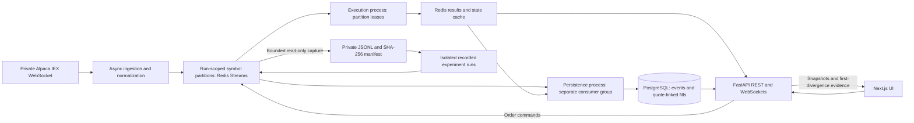

# Architecture

## Current implemented architecture



Recorded runs use distinct namespaces and bounded subprocesses, not the live registry. Public generated fixtures enter replay without Alpaca or private files. This diagram shows responsibilities, not measured multi-host deployment.

### Implemented tradeoffs

| Choice | Benefit | Cost or limit |
| --- | --- | --- |
| Redis Streams over Kafka | Small local stack, consumer groups, pending delivery | Retained Redis history is required for reconstruction |
| At-least-once delivery plus stable identities | Scoped retry/restart correctness | Not exactly-once transport; cooperative leases do not fence in-flight SQL |
| Fixed symbol partitions | Per-partition source order and concurrent unrelated work | Hot symbols can bottleneck; no in-run repartitioning |
| Redis cache | Fast quote/order reads | Freshness checks required; no general SQL-to-cache rebuild service |
| PostgreSQL over TimescaleDB | Relational fill/quote joins and ordinary migrations | Time-series extension deferred until measured needs justify it |
| Local-first private mode | Actual feed and saved input without hosted resources | Operator startup, vendor rights, unverified laptop suspension |
| Independent top-of-book orders | Deterministic controlled experiments | No shared liquidity, queue priority, depth, fees, or broker-exact fills |
| Publish then process finite replay | Canonical outcomes across publication pacing | Not incremental streaming execution capacity |

Actual recording/offline comparisons passed October 6. Recovery tests do not certify physical suspension, automatic cold boot, user demand, or multi-machine scaling.

### Recorded-market extension

Private FastAPI controls one bounded capture and one experiment job, with file locking preventing another API process from owning the same recording directory. Capture reads the existing Redis source; it never opens an Alpaca socket, changes subscriptions, trims streams, or extends their lifetime. A private bind-mounted directory stores immutable validated input, provenance, job state, canonical outcomes, and paged decision traces.

Recorded jobs publish complete isolated source streams, then launch the existing engine and persistence entry points as separate bounded subprocesses. Each role has one retry against the same run/order IDs; acknowledgements follow recoverable results or database commits. Pending recovery scans all pages, not only the first 100 entries. API restart marks unfinished recording/jobs incomplete/failed; it does not claim automatic job resume. This is local process separation, not measured multi-machine scaling.

The existing execution engine performs pre-entry warm-up without execution. It then applies identical order rules to each independent configuration. Comparison traces identify the earliest activation/eligibility/quantity/state difference and distinguish it from first fill divergence and final fills/state. Source identity, input checksum, market-time entry, model version, and configuration remain inspectable. Public generated behavior is unchanged; non-public run modes are denied by public reads and WebSockets.

This section describes shipped code. The original proposal below is retained as historical design intent, not an implementation claim.

```text
Public: Next.js → FastAPI → generated fixture → Redis source
                    ↓ demand HTTP dispatch
             Engine → Redis result → Persistence → PostgreSQL
                    ↓ completed WebSocket snapshot
             Browser local trace animation

Private: Alpaca IEX → async ingestion → retained symbol partitions
                                      ├→ continuous engine → results
                                      └→ continuous persistence → PostgreSQL
         Next.js → FastAPI → live order command ────┘
         Next.js ← ongoing WebSocket snapshots + status/quote reads
```

- All Python applications share `services/engine/src/market_execution_lab`; separate entry points provide process ownership without separate source packages.
- Public Fly requires exactly one existing engine and persistence machine. API submission wakes them and executes engine then persistence before returning. Local queue mode remains separate.
- Public replay reconstructs and finalizes finite input; it is not incremental processing during producer pacing. Private workers continuously process new events and snapshot order progress without ending their live session.
- CRC32(symbol) modulo 16 partitions each isolated run. This is not a global per-stock queue across runs.
- Private ingestion authenticates before subscribing, reconnects transient failures with backoff capped at 30 seconds, skips invalid market messages, and stops on fatal authentication/subscription errors. Provider correction/cancellation semantics are not modeled.
- Private worker partition leases reject competing owners; lost leases stop the current processing attempt before entry-point recovery. This is not consensus or a zero-pause fencing guarantee. Replacement engines rebuild from retained delivered input and reclaim pending messages.
- Each live order is an independent top-of-book experiment; orders do not compete for shared liquidity. Snapshots persist submitted/active/partial/filled progress; session closure preserves fills and cancels remainders with a durable reason. No live zero-latency counterfactual is claimed.
- Live persistence batches up to 100 source messages and acknowledges after commit; finite replay still writes market events individually. Results update order progress independently of session completion.
- Private sessions allow up to ten symbols with unchanged hard caps of 256 orders and 100,000 source messages per partition. Default rollover thresholds are 240 orders, 90,000 messages, or 30 minutes. PostgreSQL lifecycle rows record closing intent, one successor, completion, and Redis expiration progress. Atomic Redis boundaries stop admissions, workers drain and persist terminal snapshots, then the successor becomes authoritative. Worker ownership checks follow registry changes; ingestion resume restores durable subscriptions. No coordinated rollover requires a manual worker restart.
- Live entry points recover specifically from expired ownership by releasing only their own leases, waiting one second, acquiring fresh ownership, and reconstructing retained history against the authoritative registry. A Redis timeout enters this path only when Redis confirms ingestion's lease was lost. This in-process recovery does not consume Docker's three crash retries. Competing ownership, missing history, other dependency failures, and mixed unrelated exception groups do not enter an unlimited retry loop; fatal authentication exits without restart. Cooperative leases still do not fence an already-running database operation.
- Only completed, lifecycle-registered private sessions are retention-eligible: 15-minute Redis recovery grace, one-hour non-triggering raw events, and 24-hour order/fill explanations by default. Triggering quotes outlive raw-event pruning. SQL cleanup is batched and excludes active/closing work, public replays, and unregistered benchmarks. This does not guarantee fixed disk usage or recover destroyed Redis history.
- Private production pauses at 10,000 source pending/unconsumed messages; the order API rejects stale quotes, disconnected feeds, unsubscribed symbols, and excess capacity. The 15-second freshness policy is not exchange-grade market-status handling. Pausing/reconnecting may miss provider events; none are invented.
- Redis hashes cache market/order state, quote-specific timestamps, and private session status. Recovery uses retained input; no general database-to-cache rebuild service exists.
- PostgreSQL stores events, runs, orders, fills, transitions, watchlists, and settings. Benchmark results are JSON files, not database tables. No sorted-set state model or bundled Grafana dashboards are implemented.
- Public admission uses 1,000 weighted credits/month: `max(1, ceil(event_count / 25))` credits per attempt. A 300-event experiment costs 12. Provider-counter safety remains an external acceptance check.
- Public source/cache/result TTLs and idle shutdown remain unchanged. Abandoned public runs are not automatically resumed; global queue-job crash recovery is not certified.
- Finite replay scaling and continuous certification use local threads, not a measured fleet of distributed engine machines. Durable-write latency is separate from engine batch time and simulated execution delay.
- Private endpoints require a separate private network or loopback deployment and separate dependencies. CORS is not authentication. Public reads/WebSockets reject private session data. Continuous private ingestion is not an idle-safe public workload.

## Historical original proposal (not a completion checklist)

## Architectural Goals

- Support real-time market-data ingestion and UI updates.
- Isolate ingestion from downstream processing.
- Scale processing workers independently.
- Preserve correctness during retries and worker restarts.
- Keep frequently accessed state available at low latency.
- Retain enough history for replay and analysis.
- Make throughput, latency, and failures observable.
- Run the same deterministic execution engine for live and replay inputs.
- Prevent restricted live market data from entering the public deployment.

## Component Model

```text
Alpaca IEX or Replay Source
            |
            v
     Ingestion / Replay
            |
            v
 Partitioned Redis Streams <------- FastAPI Order Commands
            |
       +----+----------------+
       |                     |
       v                     v
 Engine Workers       Persistence Worker
       |                     |
       v                     v
 Redis Materialized State   PostgreSQL
       |                     |
       +----------+----------+
                  |
                  v
              FastAPI
          REST + WebSockets
                  |
                  v
          Next.js / TypeScript
```

## Component Responsibilities

### Ingestion Service

- Maintains the external data connection.
- Converts Alpaca or fixture-specific messages into versioned internal events.
- Assigns ingestion timestamps and identifiers.
- Routes each event to a stable symbol partition.
- Publishes events without performing execution calculations.
- Exists only in private live mode when using Alpaca credentials.

### Replay Service

- Reads generated, licensed, or private recorded events.
- Preserves source event time while assigning replay metadata.
- Publishes through the same partitioning path as live ingestion.
- Supports 1x, 10x, and maximum safe playback.
- Uses a run-specific namespace so replay cannot modify live state.

### Redis Streams

- Uses a fixed number of symbol partitions chosen before a run.
- Routes a symbol with a stable hash so all of its market and order events share one partition.
- Provides separate engine and persistence consumer groups.
- Uses at-least-once delivery; workers must therefore be idempotent.
- Retains pending events for recovery and exposes consumer lag.
- Sends permanently invalid events to a dead-letter stream.

### Engine Workers

- Own one or more stream partitions, with only one active engine consumer per partition.
- Process unrelated symbols and partitions concurrently while keeping one symbol ordered.
- Activate simulated orders according to event time plus configured latency.
- Apply the documented top-of-book fill rules.
- Store processed-event and fill identifiers so retries cannot duplicate state.
- Produce order-state, fill, explanation, and metric events.

### Persistence Worker

- Consumes normalized market, order, fill, and replay events through an independent consumer group.
- Writes bounded batches to PostgreSQL.
- Retries transient failures without blocking engine workers.
- Exposes write backlog and batch-duration metrics.

### State Cache

- Stores current quote/trade state, active orders, positions, and session progress.
- Separates live and replay keys by namespace and run identifier.
- Uses expiration for inactive sessions, not for durable business records.
- Is rebuildable from PostgreSQL and retained stream events.

### PostgreSQL

- Stores normalized events, replay sessions, simulated orders, fills, explanations, and benchmark results.
- Supports historical queries and deterministic replay.
- Remains the source of truth for durable application data.
- Uses regular PostgreSQL tables for the MVP; TimescaleDB is deferred until benchmarks justify it.

### API and WebSocket Gateway

- Exposes symbols, current state, order submission, order results, and replay control.
- Validates user input.
- Enforces public-demo versus private-live mode.
- Coalesces backend events into browser updates at a bounded rate rather than forwarding every tick.
- Does not own long-running processing work.

## Repository Boundary

Use one repository with separately runnable applications:

```text
frontend/             Next.js application
services/api/         FastAPI REST and WebSocket gateway
services/ingestion/   Private Alpaca adapter
services/engine/      Partitioned execution workers
services/persistence/ PostgreSQL writer
services/replay/      Fixture and replay producer
shared/               Event and domain contracts
tests/                Unit, integration, replay, and load tests
infra/                Local containers and deployment configuration
```

The exact folder names may change during repository scaffolding, but service ownership must remain intact.

## Concurrency Model

- AsyncIO handles provider WebSockets, Redis I/O, database batching, API requests, and browser WebSockets.
- Separate processes provide failure isolation and parallel replay/engine execution.
- Symbols are assigned to fixed stream partitions with a stable hash.
- One active engine consumer owns each partition, preserving stream order within that partition.
- Different partitions execute concurrently across worker processes.
- Replay runs can execute concurrently because every run has an isolated namespace.
- Persistence may batch across symbols because it does not make execution decisions.
- The API never directly mutates order state; it appends an order command to the owning partition.

Scaling adds workers until every partition has an owner. Increasing the partition count requires starting a new run or a controlled repartitioning procedure; it is not changed while a run is active.

## Caching Strategy

| Key pattern | Contents | Owner | Durability |
| --- | --- | --- | --- |
| `state:{mode}:{run}:{symbol}` | Latest quote, trade, sequence, and freshness | Engine | Rebuildable |
| `order:{mode}:{run}:{order_id}` | Current order state and remaining quantity | Engine | PostgreSQL-backed |
| `active:{mode}:{run}:{symbol}` | Active order identifiers | Engine | Rebuildable |
| `session:{mode}:{run}` | Replay progress and status | Replay/engine | PostgreSQL-backed |
| `dedupe:{mode}:{run}:{partition}` | Recently processed event identifiers | Engine | Stream/database-backed |

Redis is the low-latency materialized view, not the sole durable source of truth. Session keys may expire after an inactivity window determined during implementation; live market-state keys remain freshness-stamped so stale data is visible rather than silently trusted.

## API Boundary

Initial REST resources:

- `GET /health` and `GET /ready`
- `GET /api/v1/symbols`
- `GET /api/v1/market/{symbol}`
- `POST /api/v1/orders`
- `GET /api/v1/orders/{order_id}`
- `POST /api/v1/replays`
- `GET /api/v1/replays/{run_id}`

Initial WebSocket resource:

- `GET /ws/v1/sessions/{run_id}` for market snapshots, order transitions, fills, replay progress, and connection health

Schemas are versioned. Unknown fields may be ignored for forward compatibility, but unknown schema versions are rejected.

## Failure Model

- **Market-data disconnection:** mark live data stale, stop new simulated live orders, reconnect with bounded exponential backoff, and never invent missing events.
- **Duplicate event:** detect the event identifier before applying state; acknowledge without creating another fill.
- **Stale or out-of-order event:** persist and count it, but do not replace newer current state or retroactively alter completed fills.
- **Worker termination:** leave unacknowledged entries pending; a replacement consumer claims them and resumes idempotently.
- **Redis unavailable:** fail readiness, stop accepting new orders, and reconnect without acknowledging unprocessed work.
- **Database slow or unavailable:** allow the persistence backlog to grow to a configured threshold; then pause producers rather than silently discard durable events.
- **Cache loss:** rebuild materialized state from durable events before accepting new orders.
- **Browser disconnect:** retain the session server-side; the client fetches current state and resumes WebSocket updates after reconnecting.

## Architecture Decisions

- [x] Redis Streams rather than Kafka for the MVP
- [x] PostgreSQL rather than TimescaleDB initially
- [x] One repository with independently runnable services
- [x] Stable symbol hash as the market/order partitioning key
- [x] At-least-once delivery with idempotent workers
- [x] One deterministic execution engine for live and replay modes
- [x] No user authentication in the public replay MVP
- [x] Private live mode controlled by operator deployment configuration
